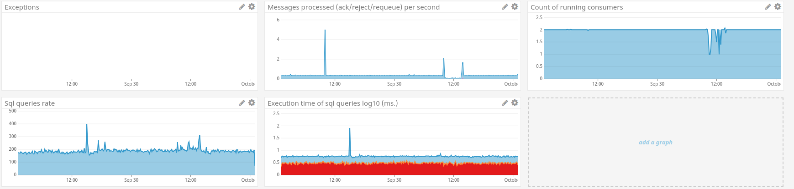
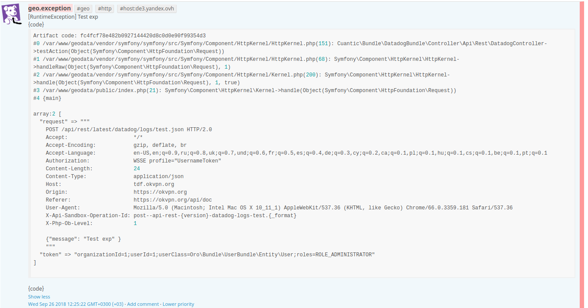
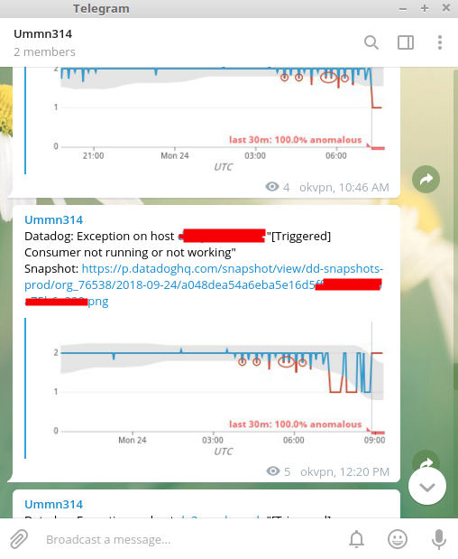
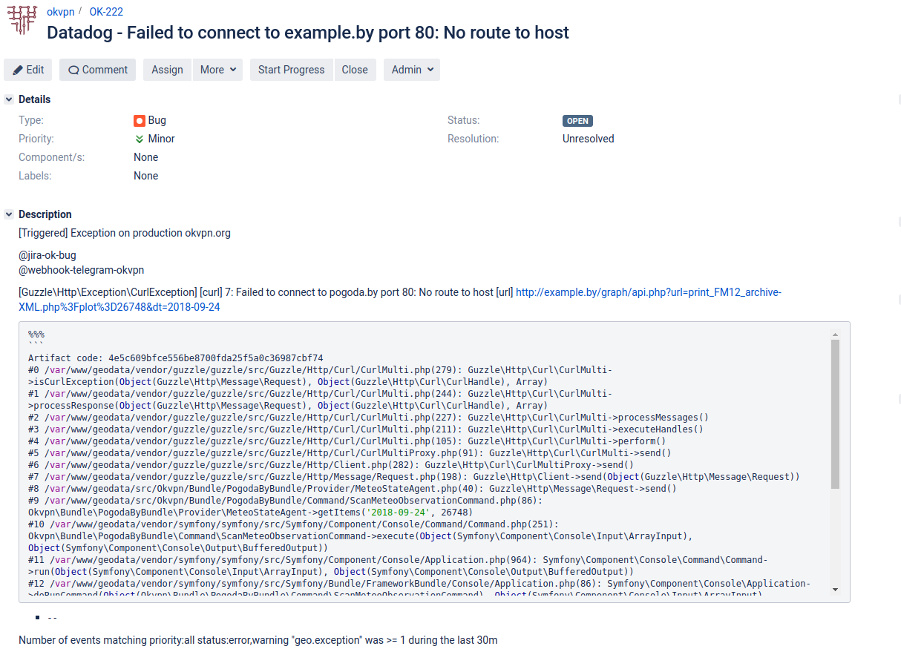

# Symfony datadog integration

Symfony [Datadog][1] integration to monitor and track for application errors and send notifications about them.

## Benefits

Use datadog-symfony for:

* Monitor production applications in realtime.
* Application performance insights to see when performance is geting degradated.
* Access to the `okvpn_datadog.client` through the container.
* Send notification about errors in Slack, email, telegram, etc.
* Create JIRA issue when some alarm/exception triggers using this [plugin][4]

## Install
Install using [composer][2] following the official Composer [documentation][3]: 

1. Install via composer:
```
composer require okvpn/datadog-symfony
```

2. And add this bundle to your AppKernel:

```php
<?php

use Symfony\Component\HttpKernel\Kernel;
use Symfony\Component\Config\Loader\LoaderInterface;

class AppKernel extends Kernel
{
    public function registerBundles()
    {
        $bundles = array(
            // ....
            new Okvpn\Bundle\DatadogBundle\OkvpnDatadogBundle(), //Should loaded after framework bundle
        );
    }
    
    public function registerContainerConfiguration(LoaderInterface $loader)
    {
        $loader->load($this->getRootDir().'/config/config_'.$this->getEnvironment().'.yml');
    }
}
```

3. Base configuration to enable the datadog client in your `config.yml`

```
okvpn_datadog:
    enable: true
    namespace: app # You app namespace for custome metric app.*, see https://docs.datadoghq.com/developers/metrics/#naming-metrics
```

## Custom metrics that provided by OkvpnDatadogBundle

Where `app` metrics namespace.

|    Name                       |    Type      |                         Description                                        |
|-------------------------------|:------------:|:--------------------------------------------------------------------------:|
| app.exception                 | counter      | Track how many exception occurred in application per second                |
| app.doctrine.median           | gauge        | Median execute time of sql query (ms.)                                     |
| app.doctrine.avg              | gauge        | Avg execute time of sql query (ms.)                                        |
| app.doctrine.count            | rate         | Count of sql queries per second                                            |
| app.doctrine.95percentile     | gauge        | 95th percentile of execute time of sql query (ms.)                         |
| app.exception                 | event        | Event then exception is happens                                            |
| app.http_request              | timing       | Measure timing how long it takes to fully render a page                    |

## Configuration

A more complex setup look like this `config.yml`:

```

okvpn_datadog:
    enable: true          # Default false
    namespace: app        # Metric namespace
    port: 8125            # datadog udp port
    hostname: 127.0.0.1
    tags:                 # Default tags which sent with every request
        - example.com
        - cz1
    doctrine: true        # Enable timing for sql query
    exception: all        # Send event on exception
                          #   *all*      - handle all exceptions: logger error context, console error, http error.
                          #   *uncaught* - handle uncaught exceptions: console error, http error.
                          #   *none*     - disable exceptions handler
                          
    dedup_path: null      # Path to save duplicates log records across multiple requests. 
                          # Used to prevent send multiple event on the same error
    
    dedup_keep_time: 86400 # Time in seconds during which duplicate entries should be suppressed after a given log is sent through
    artifacts_path: null   # Long events is aggregate as artifacts, because datadog event size is limited to 4000 characters.
    
    handle_exceptions:     # Skip exceptions
        skip_instanceof:
            - Symfony\Component\Console\Exception\ExceptionInterface
            - Symfony\Component\HttpKernel\Exception\HttpExceptionInterface
        skip_command:     # Skip exception for console command
            - okvpn:message-queue:consume
```

## Usage

```php
$client = $this->container->get('okvpn_datadog.client');

/*
 * Increment/Decriment
 * 
 * Counters track how many times something happens per second, such as page views.
 * @link https://docs.datadoghq.com/developers/dogstatsd/data_types/#counters
 *
 * @param string          $metrics    Metric(s) to increment
 * @param int             $delta      Value to decrement the metric by
 * @param float           $sampleRate Sample rate of metric
 * @param string[]        $tags       List of tags for this metric
 *
 * @return DogStatsInterface
 */
$client->increment('page.views', 1);
$client->increment('page.load', 1, 0.5, ['tag1' => 'http']);
```

### Sets

```php

$consumerPid = getmypid();
$client->set('consumers', $consumerPid);
```

### Timing 

```php
$client->timing('http.response_time', 256);
```

See more metrics here [DogStatsInterface](src/Client/DogStatsInterface.php) 

## Impact on performance 

Datadog bundle use UDP protocol to send custom metrics to DogStatsD collector, that usually running on localhost (127.0.0.1).
Because it uses UDP, your application can send metrics without waiting for a response. DogStatsD aggregates multiple data
points for each unique metric into a single data point over a period of time called the flush interval and sends it to Datadog where 
it is stored and available for graphing alongside the rest of your metrics.


## Screencasts.

What can be done using datadog.

### Datadog custom symfony dashboard



### Datadog Anomaly Monitor of running consumers


### Live exception event stream



### Send notification about errors in telegram.



### Create JIRA issue when some alarm/exception triggers



License
-------
MIT License. See [LICENSE](LICENSE).

[1]:    https://docs.datadoghq.com/getting_started/
[2]:    https://getcomposer.org/
[3]:    https://getcomposer.org/download/
[4]:    https://www.datadoghq.com/blog/jira-issue-tracking/

